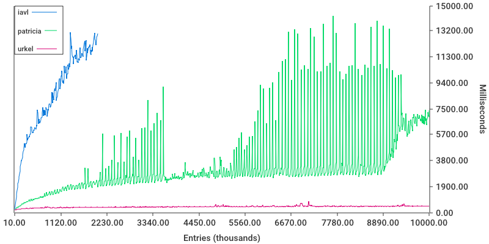
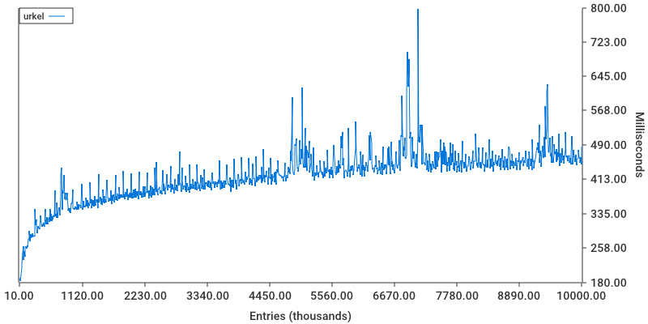

Persistent merkle trees comparison
==================================

Benchmarks are comparing how much time and memory required by each merkle store to insert batch of records.
Each store writes N random records and commits them, syncing to disk.

#TODO specify versions

How to run:
---

Build binary and plotting tool once:

```
make build
```

Run benchmarks, with `make run-N` where N is a block number.

Available commands:

```
make run-100
make run-1000
make run-10000
make run-40000
```

Generate plots for prefedined N:

```
make plot-100
make plot-1000
make plot-10000
make plot-40000
```

View all of them with default browser:

```
make view-all
```

Plots
---

Only two plots are available:
- `time`, every tick tracks how much time was spent to insert and sync block of records on disk
- `memory`, every tick tracks the difference between [HeapAlloc](https://golang.org/src/runtime/mstats.go?s=5620:15036#L137) value after insertion and HeapAlloc before running tests.


Plots are stored in `_assets` directory. Example, commision of 10,000 entries:




Separate plot for urkel:


